# Presentación de Arquitectura — Plataforma Business Financiero

> **Siesa Business** · GKE Autopilot · GCP `us-east1` · `finance.siesacloud.dev`

---

## Índice

| # | Diagrama | Descripción |
|---|---|---|
| 1 | [Contexto del Sistema](#1-contexto-del-sistema) | Ecosistema y actores externos |
| 2 | [Mapa de Servicios](#2-mapa-de-servicios) | 6 microservicios + app shell en Kubernetes |
| 3 | [Frontend — Micro-Frontends](#3-frontend--micro-frontends) | SPA distribuida con import map |
| 4 | [Gateway y Routing HTTP](#4-gateway-y-routing-http) | URL rewriting, Cloud Armor, HTTPRoutes |
| 5 | [Arquitectura Event-Driven](#5-arquitectura-event-driven) | Cloud Pub/Sub: topics y suscripciones |
| 6 | [Dapr — Service Mesh Ligero](#6-dapr--service-mesh-ligero) | mTLS, state, secrets, cron bindings |
| 7 | [Infraestructura GCP](#7-infraestructura-gcp) | Todos los recursos cloud |
| 8 | [Base de Datos — Cloud SQL](#8-base-de-datos--cloud-sql) | Auth Proxy + schemas por servicio |
| 9 | [Pipeline CI/CD](#9-pipeline-cicd) | GitHub Actions + Cloud Build |
| 10 | [Observabilidad](#10-observabilidad) | Jaeger + OpenTelemetry Collector |
| 11 | [Seguridad en Capas](#11-seguridad-en-capas) | Cloud Armor → WIF → mTLS → JWT |
| 12 | [Reconciliación de Proyecciones](#12-reconciliación-de-proyecciones) | Cron bindings + sincronización de eventos |
| 13 | [Patrones Implementados](#13-patrones-implementados) | Catálogo de patrones por capa |

---

## 1. Contexto del Sistema

Vista de alto nivel: quién interactúa con la plataforma y qué sistemas externos son necesarios.

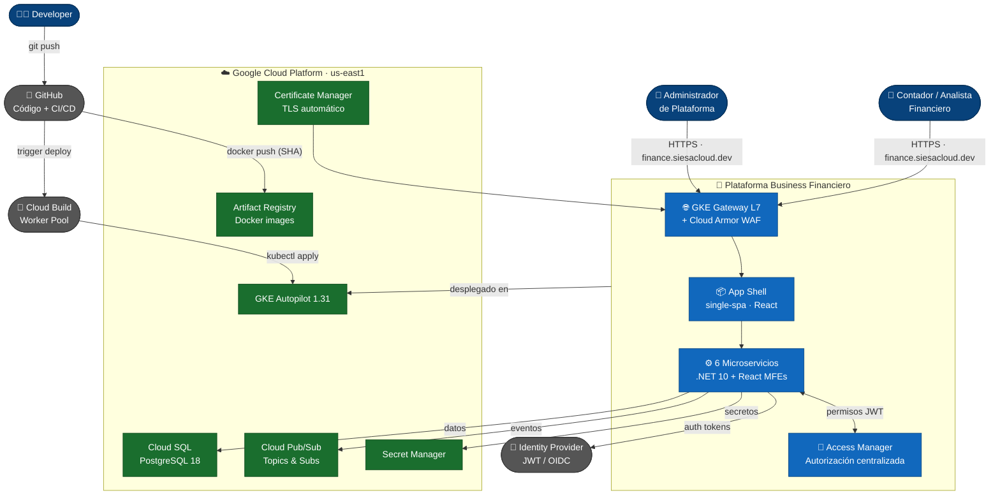

---

## 2. Mapa de Servicios

Cada servicio tiene su propio namespace Kubernetes con una API (.NET 10) y un Micro-Frontend (React + Vite), más un sidecar Dapr y un proxy Cloud SQL.

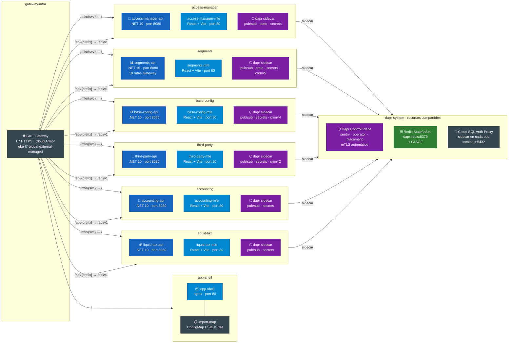

---

## 3. Frontend — Micro-Frontends

El App Shell es el host single-spa. Carga el import map desde Kubernetes y cada MFE se monta dinámicamente desde el CDN de GKE.

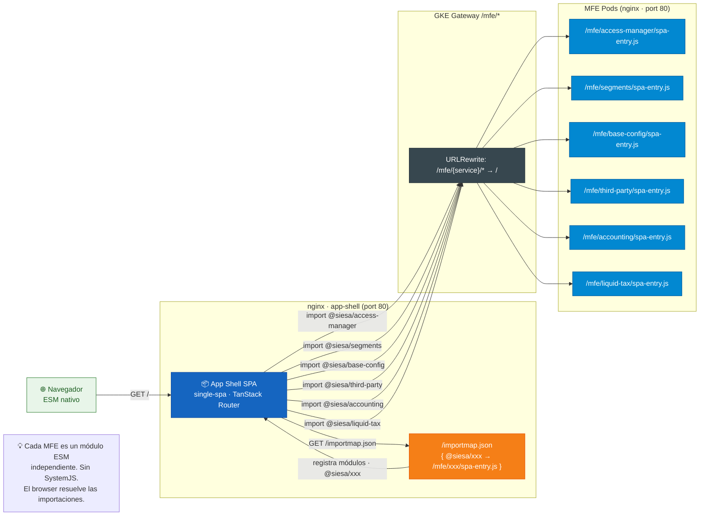

---

## 4. Gateway y Routing HTTP

El GKE Gateway API L7 aplica URL rewriting: el frontend llama `/api/{prefijo}/*` y el Gateway reescribe a `/api/v1/{prefijo}/*` antes de llegar al backend.

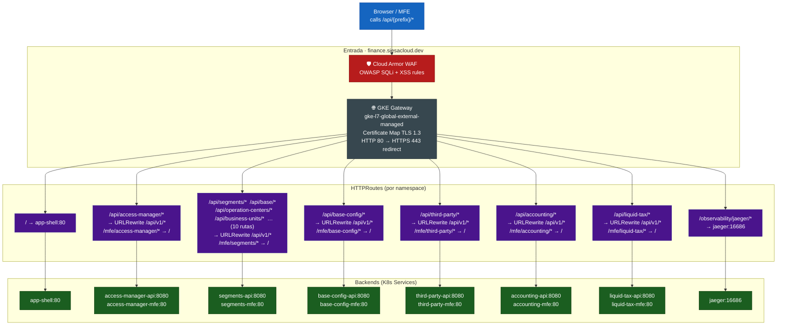

**Regla crítica de routing:** el frontend **NUNCA** usa `/api/v1/...` en sus llamadas. El Gateway es la capa de indirección que añade la versión.

| HealthCheck | Tipo | Puerto | Intervalo |
|---|---|---|---|
| Todos los APIs | TCP | 8080 | 15s / timeout 5s |
| Jaeger UI | TCP | 16686 | 15s / timeout 5s |

---

## 5. Arquitectura Event-Driven

Los servicios se comunican mediante **Google Cloud Pub/Sub** a través de Dapr. Cada servicio tiene un topic propio; los consumidores se suscriben selectivamente. `disableEntityManagement: true` — Terraform crea todos los topics y suscripciones.

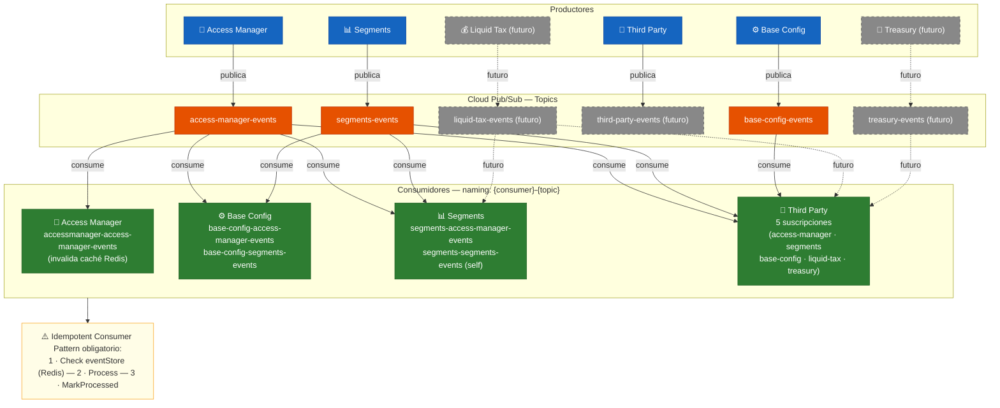

### Transactional Outbox Pattern

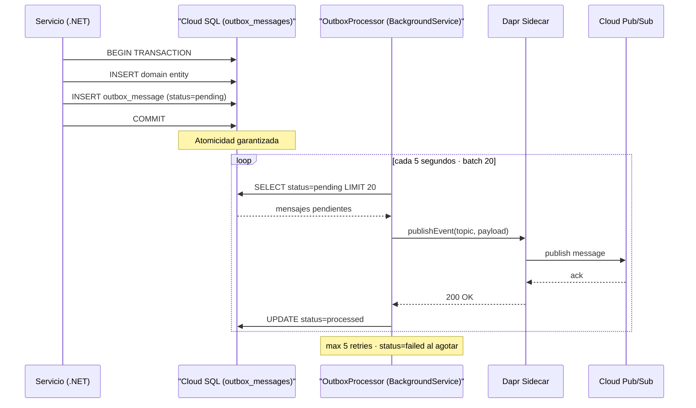

---

## 6. Dapr — Service Mesh Ligero

Dapr reemplaza la complejidad de Istio. Cada pod tiene un sidecar `daprd` que gestiona mTLS, pub/sub, state store, secrets y cron bindings.

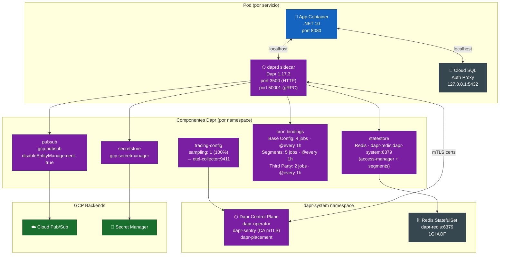

### Cron Bindings — Reconciliación Horaria

| Servicio | Jobs | Schedule | Endpoint |
|---|---|---|---|
| `base-config` | 4 | `@every 1h` | `/jobs/reconcile-{companies,operation-centers,user-company-assignments,users}` |
| `segments` | 5 | `@every 1h` | `/reconcile-{cities,countries,neighborhoods,states,users}` |
| `third-party` | 2 | `@every 1h` | `/reconcile-{companies,users}` |

---

## 7. Infraestructura GCP

Toda la infraestructura es **Terraform** — ningún recurso se crea manualmente.

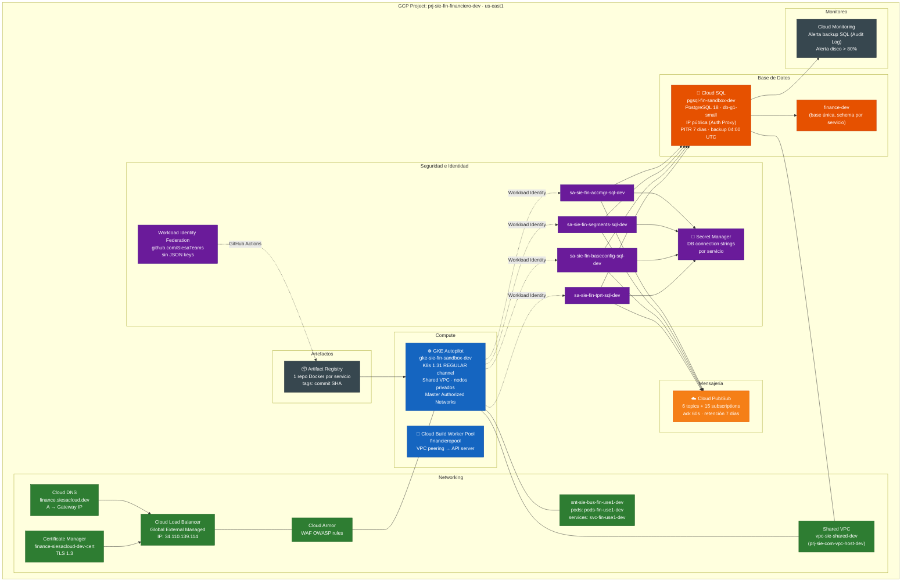

---

## 8. Base de Datos — Cloud SQL

Una instancia PostgreSQL 18, una base de datos `finance-dev`, con **schemas separados por servicio**. Cada servicio se conecta a través del Cloud SQL Auth Proxy (sidecar).

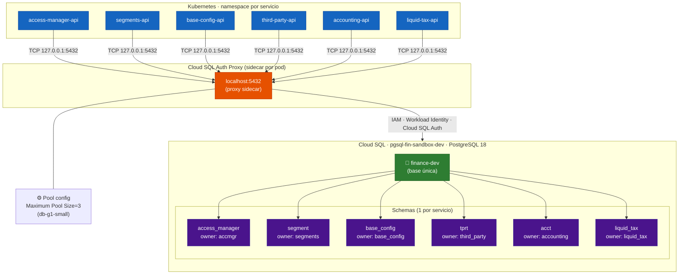

**Convenciones de migrations:**
- `auto-migrate` en startup (`db.Database.MigrateAsync()`)
- `IEntityTypeConfiguration` siempre declara `builder.ToTable(tabla, "base_config")` con el schema correcto (sin guiones)
- `outbox_messages` en cada schema — parte del Transactional Outbox Pattern

---

## 9. Pipeline CI/CD

### Servicios (Backend + MFE)

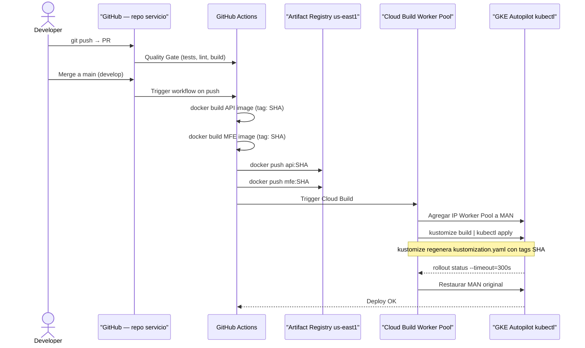

### Infraestructura (este repo)

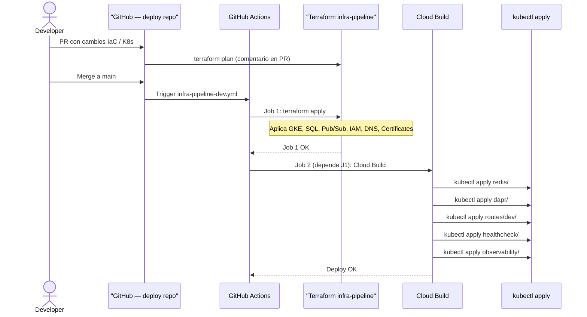

> **⚠️ Race condition MAN:** Dos pipelines concurrentes causan `CLUSTER_ALREADY_HAS_OPERATION`. No hay retry automático — re-run manual.

---

## 10. Observabilidad

Distributed tracing al 100% en desarrollo. Dapr envía trazas via Zipkin al OTel Collector, que filtra ruido de Pub/Sub y reenvía a Jaeger.

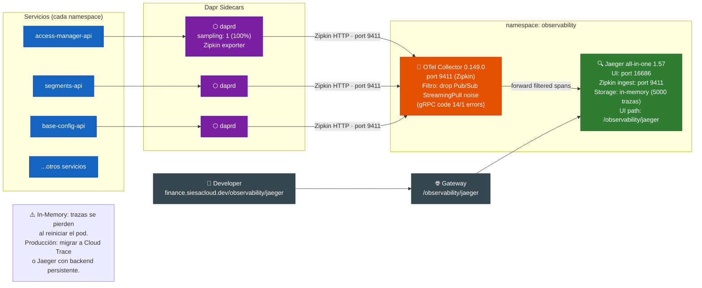

---

## 11. Seguridad en Capas

La seguridad es **defense-in-depth**: cada capa añade una barrera adicional.

```mermaid
flowchart TB
    classDef layer fill:#37474f,stroke:#263238,color:#fff
    classDef threat fill:#b71c1c,stroke:#7f0000,color:#fff
    classDef ok    fill:#1b5e20,stroke:#003300,color:#fff

    INTERNET["🌐 Internet<br/>Requests HTTP/HTTPS"]

    subgraph L1["Capa 1 — Red (Cloud Armor WAF)"]
        CA["🛡️ Cloud Armor<br/>OWASP SQLi rules<br/>OWASP XSS rules<br/>Rate limiting<br/>IP reputation"]:::layer
    end

    subgraph L2["Capa 2 — TLS (Certificate Manager)"]
        TLS["🔒 TLS 1.3<br/>Certificate Manager<br/>finance.siesacloud.dev<br/>HTTP → HTTPS redirect"]:::layer
    end

    subgraph L3["Capa 3 — Autenticación (Access Manager)"]
        JWT["🎫 JWT Validation<br/>Access Manager middleware<br/>Bearer token requerido<br/>en todos los endpoints"]:::layer
        PERM["🔐 Autorización por permiso<br/>RequirePermission(\"prefix.entity.action\")<br/>Redis cache · invalidación por eventos"]:::layer
    end

    subgraph L4["Capa 4 — Service-to-Service (Dapr mTLS)"]
        MTLS["🔑 mTLS automático<br/>Dapr Sentry CA<br/>Rotación de certificados<br/>identidades SPIFFE"]:::layer
        GUARD["🚪 dapr-caller-app-id guard<br/>Endpoints /snapshot/*<br/>rechazan 403 si falta header"]:::layer
    end

    subgraph L5["Capa 5 — Identidad Cloud (Workload Identity)"]
        WIF["🪪 Workload Identity Federation<br/>GitHub Actions sin JSON keys<br/>assert.repository_owner == SiesaTeams<br/>K8s SA → GCP SA binding"]:::layer
        SA["🔑 Service Accounts dedicados<br/>por servicio<br/>principle of least privilege"]:::layer
    end

    subgraph L6["Capa 6 — Secretos (Secret Manager)"]
        SM["🗝️ GCP Secret Manager<br/>DB connection strings<br/>Rotación en Secret Manager<br/>Nunca en variables de entorno<br/>ni en código fuente"]:::layer
    end

    INTERNET --> L1 --> L2 --> L3 --> L4
    L4 --> L5 --> L6
```

### Matriz de Acceso por Servicio

| Servicio | GCP SA | Roles Pub/Sub | Cloud SQL | Secret Manager |
|---|---|---|---|---|
| Access Manager | `sa-sie-fin-accmgr-sql-dev` | publisher + subscriber | ✅ | ✅ |
| Segments | `sa-sie-fin-segments-sql-dev` | publisher + subscriber | ✅ | ✅ |
| Base Config | `sa-sie-fin-baseconfig-sql-dev` | publisher + subscriber | ✅ | ✅ |
| Third Party | `sa-sie-fin-tprt-sql-dev` | publisher + subscriber | ✅ | ✅ |
| Accounting | `sa-sie-fin-acct-sql-dev` | subscriber | ✅ | ✅ |
| Liquid Tax | `sa-sie-fin-liquid-tax-sql-dev` | publisher | ✅ | ✅ |

---

## 12. Reconciliación de Proyecciones

Dos capas de sincronización garantizan consistencia eventual entre servicios:

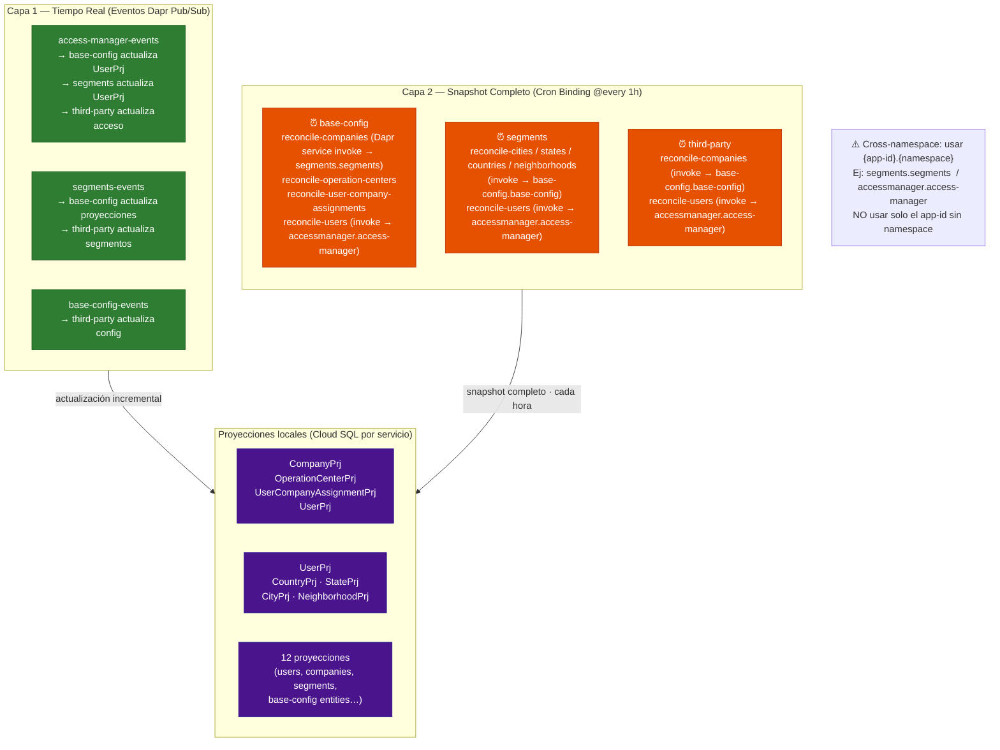

---

## 13. Patrones Implementados

Catálogo de los patrones de diseño e integración aplicados en la plataforma, agrupados por capa.

### Mapa de Patrones por Capa

```mermaid
flowchart TB
    classDef frontend  fill:#0288d1,stroke:#01579b,color:#fff
    classDef backend   fill:#1565c0,stroke:#0d47a1,color:#fff
    classDef messaging fill:#e65100,stroke:#bf360c,color:#fff
    classDef infra     fill:#37474f,stroke:#263238,color:#fff
    classDef security  fill:#6a1b9a,stroke:#4a148c,color:#fff
    classDef data      fill:#2e7d32,stroke:#1b5e20,color:#fff

    subgraph L_FE["Frontend"]
        direction LR
        P_MFE["Micro-Frontend<br/>(Import Map + single-spa)"]:::frontend
        P_ESM["ESM Module Federation<br/>(browser-native, sin SystemJS)"]:::frontend
        P_I18N["i18n Reactivo<br/>(siesa:language-changed event)"]:::frontend
    end

    subgraph L_BE["Backend — por servicio"]
        direction LR
        P_CA["Clean Architecture<br/>(Domain · Application · Infrastructure)"]:::backend
        P_CQRS["CQRS<br/>(Commands / Queries separados)"]:::backend
        P_MIGRATE["Auto-Migrate on Startup<br/>(MigrateAsync en Program.cs)"]:::backend
    end

    subgraph L_MSG["Mensajería e Integración"]
        direction LR
        P_OUTBOX["Transactional Outbox<br/>(OutboxProcessor · batch 20 · retry 5)"]:::messaging
        P_IDEMPOTENT["Idempotent Consumer<br/>(eventStore · IsDuplicateAsync)"]:::messaging
        P_EDA["Event-Driven Architecture<br/>(Cloud Pub/Sub · Dapr pub/sub)"]:::messaging
        P_RECONCILE["Two-Layer Reconciliation<br/>(eventos tiempo real + cron snapshot)"]:::messaging
    end

    subgraph L_INFRA["Infraestructura"]
        direction LR
        P_SIDECAR["Sidecar Pattern<br/>(Dapr daprd + Cloud SQL Auth Proxy)"]:::infra
        P_GW["API Gateway + URL Rewriting<br/>(/api/{prefix} → /api/v1/{prefix})"]:::infra
        P_HC["Health Check Policy<br/>(TCP por servicio · GKE Gateway)"]:::infra
        P_IAC["Infrastructure as Code<br/>(Terraform · fuente única de verdad)"]:::infra
    end

    subgraph L_SEC["Seguridad"]
        direction LR
        P_WIF["Workload Identity Federation<br/>(GitHub Actions sin JSON keys)"]:::security
        P_MTLS["mTLS automático<br/>(Dapr Sentry CA · SPIFFE)"]:::security
        P_DID["Defense in Depth<br/>(Cloud Armor → TLS → JWT → mTLS → WIF → Secrets)"]:::security
        P_GUARD["Snapshot Guard<br/>(dapr-caller-app-id · 403 sin header)"]:::security
    end

    subgraph L_DATA["Datos"]
        direction LR
        P_SCHEMA["Schema per Service<br/>(DB única · schema aislado por servicio)"]:::data
        P_POOL["Connection Pool limitado<br/>(MaxPoolSize=3 · db-g1-small)"]:::data
        P_PITR["PITR + Backup diario<br/>(7 días WAL · 7 copias)"]:::data
    end

    L_FE --> L_BE --> L_MSG
    L_MSG --> L_INFRA
    L_INFRA --> L_SEC
    L_INFRA --> L_DATA
```

---

### Patrones de Mensajería

#### Transactional Outbox

| | |
|---|---|
| **Problema** | Publicar un evento y persistir la entidad son dos operaciones distintas — si una falla, el sistema queda inconsistente. |
| **Solución** | Ambas operaciones ocurren en la **misma transacción EF Core**. Un `BackgroundService` (`OutboxProcessor`) publica los mensajes pendientes a Dapr en segundo plano. |
| **Servicios** | `segments` · `base-config` · `third-party` · `accounting` |
| **Config** | Batch de 20 · cada 5 s · máx 5 reintentos · `status=failed` al agotar |
| **Tabla** | `{schema}.outbox_messages` |


---

#### Idempotent Consumer

| | |
|---|---|
| **Problema** | Cloud Pub/Sub puede re-entregar el mismo mensaje. Procesar dos veces un evento puede corromper proyecciones. |
| **Solución** | Cada consumer verifica `eventStore` (Redis) antes de procesar. Si ya fue procesado, retorna `200 OK` inmediatamente. |
| **Obligatorio en** | Todos los consumers Dapr Pub/Sub de la plataforma |

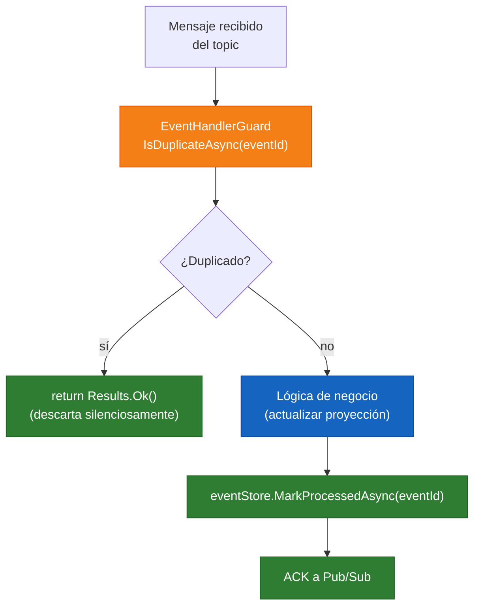

---

#### Two-Layer Reconciliation

| Capa | Mecanismo | Frecuencia | Propósito |
|---|---|---|---|
| **Capa 1 — Incremental** | Dapr Pub/Sub eventos | Tiempo real | Actualización delta por cada cambio |
| **Capa 2 — Snapshot** | Dapr cron binding → service invocation | Cada 1 hora | Re-sincronización completa como red de seguridad |

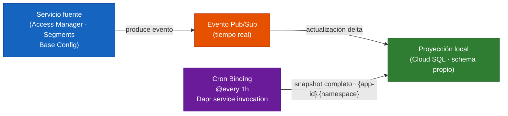

---

### Patrones de Infraestructura

#### Sidecar Pattern

Dos sidecars por pod, cada uno con una responsabilidad única:

| Sidecar | Imagen | Puerto | Responsabilidad |
|---|---|---|---|
| **Dapr daprd** | `daprd:1.17.3` | 3500 HTTP · 50001 gRPC | pub/sub · state · secrets · mTLS · cron |
| **Cloud SQL Auth Proxy** | `cloud-sql-proxy` | 127.0.0.1:5432 | Autenticación IAM con Cloud SQL sin IP privada |

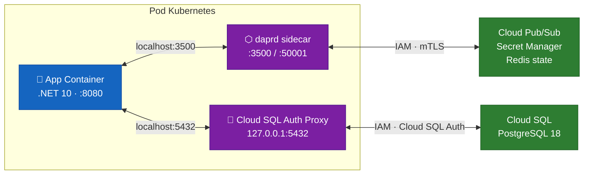

---

#### API Gateway con URL Rewriting

El Gateway actúa como capa de versionado: los MFEs nunca incluyen `/v1` en sus URLs. Esto permite cambiar la versión del API sin tocar el frontend.

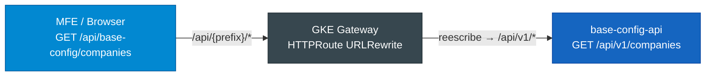

---

### Patrones de Seguridad

#### Defense in Depth — 6 Capas

```mermaid
flowchart LR
    classDef l fill:#6a1b9a,stroke:#4a148c,color:#fff

    L1["☁️ L1 · Cloud Armor<br/>WAF · SQLi · XSS<br/>Rate limiting"]:::l
    L2["🔒 L2 · TLS 1.3<br/>Certificate Manager<br/>HTTP → HTTPS"]:::l
    L3["🎫 L3 · JWT Bearer<br/>Access Manager middleware<br/>token requerido"]:::l
    L4["🔐 L4 · Autorización<br/>RequirePermission<br/>Redis cache"]:::l
    L5["🔑 L5 · mTLS Dapr<br/>Sentry CA · SPIFFE<br/>inter-service"]:::l
    L6["🪪 L6 · WIF + Secrets<br/>sin JSON keys<br/>Secret Manager"]:::l

    L1 --> L2 --> L3 --> L4 --> L5 --> L6
```

---

### Resumen — Catálogo Completo

| Patrón | Categoría | Dónde aplica | Beneficio clave |
|---|---|---|---|
| **Micro-Frontend + Import Map** | Frontend | App Shell + 6 MFEs | Deploy independiente por MFE sin recompilar el shell |
| **ESM Module Federation** | Frontend | Browser nativo | Sin SystemJS; import maps estándar W3C |
| **i18n Reactivo** | Frontend | Todos los MFEs | Cambio de idioma sin recargar la página |
| **Clean Architecture** | Backend | Todos los servicios | Separación Domain / Application / Infrastructure |
| **CQRS** | Backend | Todos los servicios | Queries y Commands con modelos optimizados |
| **Auto-Migrate on Startup** | Backend | Todos los servicios | Zero-downtime migration; OutboxProcessor no crashea |
| **Transactional Outbox** | Mensajería | segments · base-config · third-party · accounting | Publicación de eventos atómica con la persistencia |
| **Idempotent Consumer** | Mensajería | Todos los consumers | Re-entrega de Pub/Sub sin corrupción de datos |
| **Event-Driven Architecture** | Integración | Pub/Sub entre servicios | Desacoplamiento temporal entre productores y consumidores |
| **Two-Layer Reconciliation** | Integración | base-config · segments · third-party | Consistencia eventual garantizada: eventos + snapshot |
| **Sidecar** | Infraestructura | Todos los pods | Dapr y Auth Proxy sin modificar el código de la app |
| **API Gateway + URL Rewriting** | Infraestructura | GKE Gateway → todos los servicios | Versionado de API transparente al frontend |
| **Health Check Policy** | Infraestructura | Todos los servicios (TCP :8080) | GKE Gateway no enruta tráfico a pods no listos |
| **Infrastructure as Code** | Infraestructura | Terraform → todo GCP | Reproducibilidad; sin recursos manuales sin importar |
| **Workload Identity Federation** | Seguridad | GitHub Actions → GCP | Sin secretos de larga vida en repositorios |
| **mTLS automático** | Seguridad | Dapr Sentry CA | Cifrado y autenticación inter-servicio sin configuración manual |
| **Defense in Depth** | Seguridad | Cloud Armor → WIF | 6 capas independientes; fallo de una no compromete el sistema |
| **Snapshot Guard** | Seguridad | Endpoints `/snapshot/*` | Solo Dapr puede invocar snapshots; 403 a llamadas directas |
| **Schema per Service** | Datos | Cloud SQL finance-dev | Aislamiento lógico sin el costo de múltiples instancias |
| **Connection Pool limitado** | Datos | Todos los servicios | `MaxPoolSize=3` evita saturar `db-g1-small` |
| **PITR + Backup diario** | Datos | Cloud SQL | Recuperación a cualquier punto en 7 días |

---

## Resumen Ejecutivo

| Decisión Arquitectónica | Alternativa descartada | Razón |
|---|---|---|
| **Dapr** sobre Istio | Istio service mesh | Menor complejidad ops; mTLS, pub/sub y secrets en un solo plano |
| **GKE Gateway API** sobre Ingress | nginx Ingress Controller | Estándar nativo K8s; integración directa Cloud Armor + Certificate Manager |
| **single-spa + ESM nativo** sobre Nx Module Federation | Module Federation (Webpack) | Sin SystemJS; native browser imports; build independiente por MFE |
| **Cloud SQL Auth Proxy sidecar** sobre PSC | Private Service Connect | GKE ip-masq-agent bloquea PSA; sidecar más predecible |
| **WIF** sobre Service Account JSON keys | JSON key files | Seguridad: sin secretos de larga vida en repositorios |
| **Redis compartido** sobre Memorystore | Cloud Memorystore Redis | Dev: costo; PROD: migrar a Memorystore para HA |
| **Transactional Outbox** sobre dual writes | Publicar a Dapr dentro de la transacción | Atomicidad: si el evento falla, la entidad tampoco se guarda |
| **Un schema por servicio** sobre un DB por servicio | PostgreSQL separado por servicio | Dev: costo; aislamiento lógico suficiente; `db-g1-small` |

---

*Generado a partir del repositorio `business-financiero-deploy` · `finance.siesacloud.dev` · 2026-05-05*
