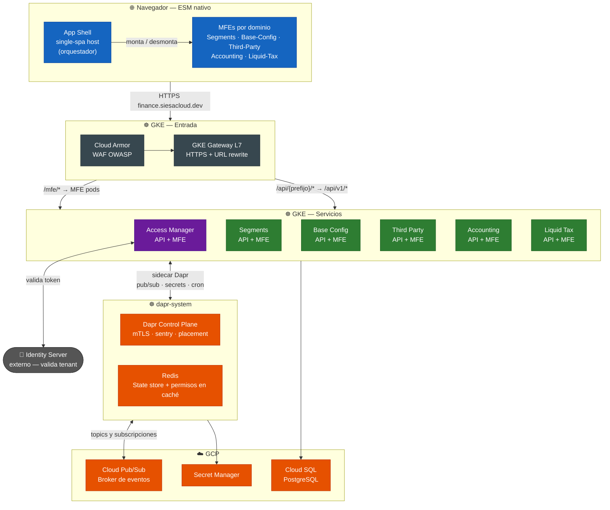
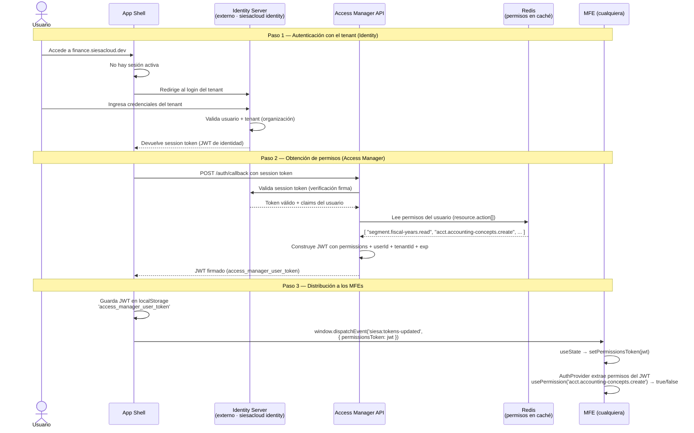
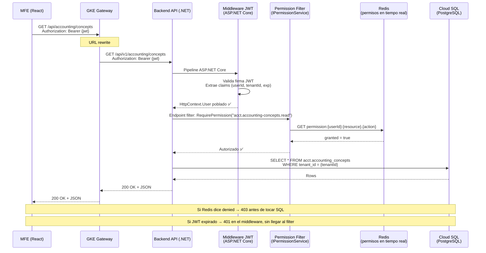
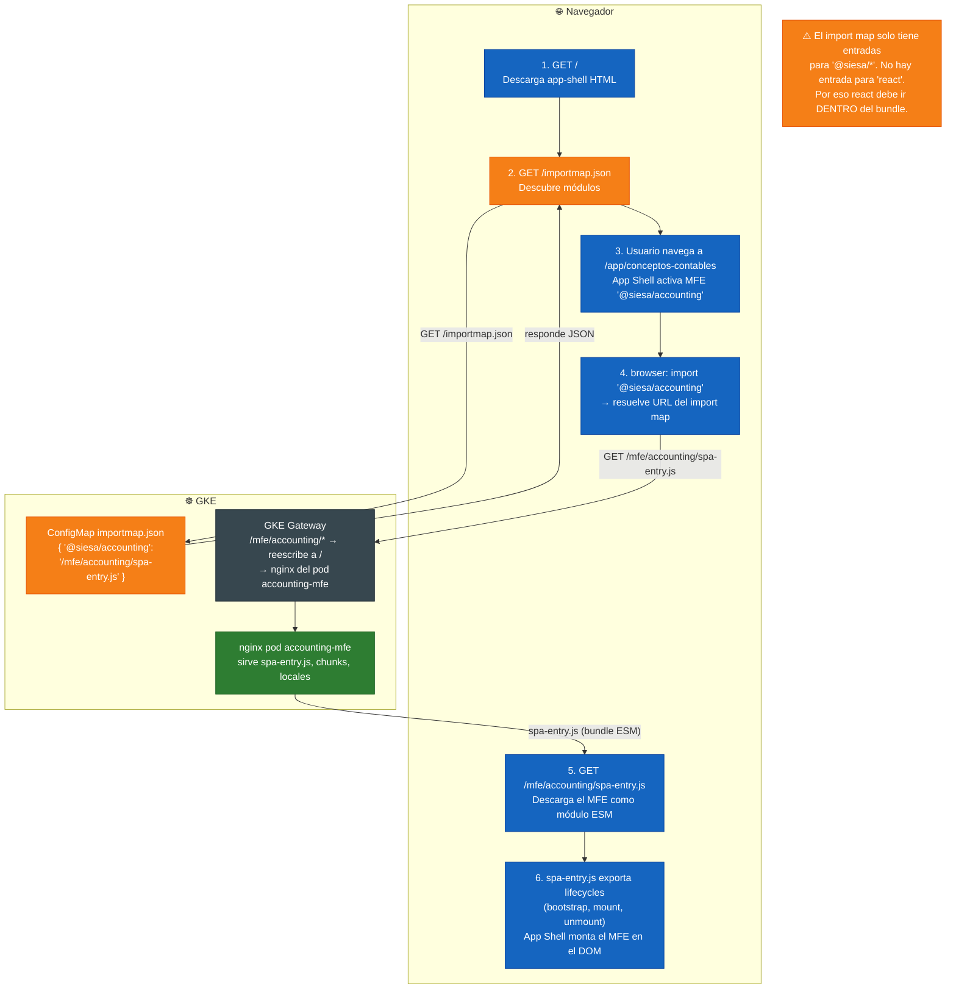
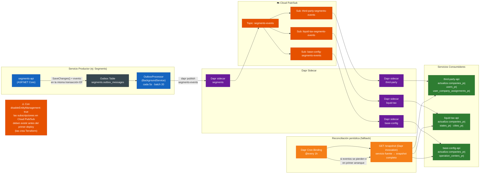

# Errores Frecuentes — Sesiones de Auditoría Mayo 2026

> Insumo para revisión con el equipo de desarrollo.  
> Fuente: sesiones de auditoría 2026-05-08 y 2026-05-11 sobre los servicios accounting, liquid-tax, third-party, segments y base-config.  
> Alcance: solo backend (.NET) y MFE (React/Vite). Sin temas de infraestructura ni despliegue.

---

## Arquitectura de la Plataforma

Antes de entrar a los errores, es importante tener clara la arquitectura general. Muchos de los bugs encontrados son consecuencia directa de no entender cómo interactúan estas piezas.

### ¿Qué es ESM nativo?

A lo largo de este documento y en el código del proyecto se menciona **ESM nativo** (_ES Modules nativos del browser_). Vale la pena explicarlo porque es la base de cómo funciona todo el sistema de MFEs.

**ESM (ECMAScript Modules)** es el sistema de módulos estándar de JavaScript moderno. Permite que un archivo JS importe otro directamente con `import`:

```javascript
import { useState } from 'react';
import { MasterPatternView } from '@siesa/ui-kit';
```

**"Nativo"** significa que el **browser mismo** entiende y ejecuta esas instrucciones `import`, sin necesidad de ningún bundler en tiempo de ejecución ni de herramientas como SystemJS o RequireJS. Los browsers modernos (Chrome, Firefox, Edge, Safari) soportan ESM de forma nativa desde hace años.

**¿Por qué importa esto para la plataforma?**

En arquitecturas más antiguas de micro-frontends (como single-spa con SystemJS), había un loader en el browser que interceptaba los `import` y los resolvía en tiempo de ejecución. Eso permitía compartir librerías como `react` entre MFEs cargándola una sola vez.

En nuestra plataforma **no hay SystemJS**. El browser resuelve los `import` directamente. Para que el browser sepa dónde encontrar un módulo por su nombre (por ejemplo `@siesa/accounting`), existe el **import map**: un JSON que mapea nombres de módulos a URLs reales.

```json
// /importmap.json — lo que el browser consulta
{
  "imports": {
    "@siesa/segments":    "/mfe/segments/spa-entry.js",
    "@siesa/accounting":  "/mfe/accounting/spa-entry.js",
    "@siesa/liquid-tax":  "/mfe/liquid-tax/spa-entry.js"
  }
}
```

Si un módulo **no está en el import map**, el browser no sabe cómo resolverlo y lanza `Failed to resolve module specifier`. Por eso `react` no puede externalizarse en los MFEs: no tiene entrada en el import map, así que cada MFE lo bundlea dentro de su propio `spa-entry.js`.

---

### 1. Visión General de Componentes

La plataforma está compuesta por tres capas principales: el **frontend distribuido** (app-shell + MFEs), los **servicios backend** (uno por dominio), y la **infraestructura de soporte** (Gateway, Dapr, Redis, Cloud Pub/Sub, Cloud SQL).

> **GKE (Google Kubernetes Engine):** el servicio de GCP que corre y administra el cluster de Kubernetes donde viven todos los servicios de la plataforma. Kubernetes es el orquestador de contenedores — se encarga de arrancar pods, reiniciarlos si fallan, escalarlos y gestionar la red entre ellos. GKE en modalidad **Autopilot** (que es la que usamos) va un paso más allá: gestiona automáticamente los nodos del cluster, sin que el equipo tenga que aprovisionar ni parchear máquinas virtuales. Todo lo que se despliega — backends, MFEs, Dapr, Redis, el Gateway — corre dentro del cluster GKE.
>
> **WAF (Web Application Firewall):** capa de seguridad que analiza cada request HTTP antes de que llegue a la aplicación y bloquea los que parecen ataques.
>
> **OWASP** (_Open Web Application Security Project_): fundación que publica el estándar de las amenazas web más comunes — inyección SQL, XSS, CSRF, entre otras. Sus reglas son el catálogo que el WAF usa para decidir qué bloquear.
>
> **Cloud Armor:** el producto de GCP que implementa el WAF. Se sitúa delante del GKE Gateway y evalúa cada request antes de que entre al cluster. Tiene reglas preconfiguradas basadas en OWASP que se activan con un toggle — no hay que escribirlas a mano. Ejemplo: un query string con `' OR 1=1 --` es rechazado con 403 por Cloud Armor y nunca llega al backend.



---

### 2. Flujo de Autenticación y Permisos

Este es el flujo más crítico de entender. Hay **dos sistemas independientes** que conviven: el **Identity Server** (autentica la sesión del tenant) y el **Access Manager** (autoriza permisos de la plataforma). Confundir los dos es la causa de muchos bugs de 401/403.



> **Punto clave para el desarrollador:** `usePermission()` en el MFE lee los permisos que vienen **dentro del JWT**. Si un permiso no está registrado en access-manager, el JWT nunca lo incluirá y `usePermission` siempre retornará `false`, sin importar lo que tenga el backend.

---

### 3. Flujo de una Petición HTTP desde el MFE al Backend

Cada llamada a la API pasa por la cadena completa: Gateway (reescritura de URL) → Backend (.NET) → validación JWT → verificación de permisos en Redis → Cloud SQL.



> **Punto clave:** Hay **dos niveles de verificación de permisos en el backend**:
> 1. **`IPermissionService` / endpoint filter**: chequea Redis en tiempo real para operaciones de lectura/consulta de endpoints individuales.
> 2. **`ISecurityServiceClient`**: usado por `BaseMasterService` antes de Create/Update/Delete. Llama internamente a Access Manager vía HTTP. Si no se configura el bypass de mock, siempre falla en desarrollo.

---

### 4. Cómo se Cargan los MFEs en el Browser

El App Shell no incluye el código de los MFEs en su propio bundle. Los carga dinámicamente usando **ESM nativo del browser** y un **import map** que define dónde encontrar cada módulo.



---

### 5. Comunicación Event-Driven entre Servicios Backend

Los servicios **no se llaman entre sí por HTTP directamente**. Toda comunicación backend-a-backend pasa por **Dapr**, que usa **Cloud Pub/Sub** como broker. Cada servicio mantiene copias locales (**proyecciones**) de los datos que necesita de otros servicios, alimentadas por eventos.



> **Punto clave para el desarrollador:** Si un servicio necesita datos de otro servicio (por ejemplo, liquid-tax necesita las empresas de segments), **no debe hacer una llamada HTTP directa**. Debe tener una proyección local alimentada por el evento correspondiente. Si la proyección no existe, hay que implementarla siguiendo el patrón Outbox + consumer.

---

## Índice de Categorías

1. [HTTP Client — No se envía el token de autenticación](#1-http-client--no-se-envía-el-token-de-autenticación)
2. [Rutas API desde el MFE — Usar `/api/v1/` directamente](#2-rutas-api-desde-el-mfe--usar-apiv1-directamente)
3. [Vite Config — Entry point, formato y bundling incorrectos](#3-vite-config--entry-point-formato-y-bundling-incorrectos)
4. [React Router — `basename` faltante y rutas en idioma incorrecto](#4-react-router--basename-faltante-y-rutas-en-idioma-incorrecto)
5. [Token de permisos — MFE no lo recibe del app-shell](#5-token-de-permisos--mfe-no-lo-recibe-del-app-shell)
6. [i18n — Textos fijos que no reaccionan al cambio de idioma](#6-i18n--textos-fijos-que-no-reaccionan-al-cambio-de-idioma)
7. [LookupField — `createFetcher` no incluye Authorization](#7-lookupfield--createfetcher-no-incluye-authorization)
8. [MasterPatternView — Selector de empresas vacío o con solo "Global"](#8-masterpatternview--selector-de-empresas-vacío-o-con-solo-global)
9. [MasterPatternView — Race condition: `companyId` undefined en primer render](#9-masterpatternview--race-condition-companyid-undefined-en-primer-render)
10. [Backend — Mock de AccessManager: bypass incompleto en GKE](#10-backend--mock-de-accessmanager-bypass-incompleto-en-gke)
11. [Backend — `ISecurityServiceClient` ignora el flag de mock](#11-backend--isecurityserviceclient-ignora-el-flag-de-mock)
12. [Backend — FKs entre tablas de proyección (error arquitectónico)](#12-backend--fks-entre-tablas-de-proyección-error-arquitectónico)
13. [Formato de permisos — Inconsistencia guión vs guión bajo](#13-formato-de-permisos--inconsistencia-guión-vs-guión-bajo)

---

## 1. HTTP Client — No se envía el token de autenticación

**Servicios afectados:** accounting, third-party, segments, liquid-tax  
**Error visible:** `401 Unauthorized` en todos los endpoints del servicio

### Qué pasó

Varios servicios copiaron un `client.ts` base y nunca agregaron el interceptor de `Authorization`. El resultado es que cada llamada al API salía sin el header `Bearer`, y el backend rechazaba todo con 401.

Variantes del mismo problema encontradas:

| Servicio | Error en `client.ts` |
|---|---|
| accounting | Sin interceptor de Authorization. `baseURL` hardcodeado a `http://localhost:7018/api/v1` |
| third-party | Sin interceptor de Authorization |
| segments (`accountService.ts`) | Usaba `import axios from 'axios'` directamente, saltándose el `apiClient` configurado |
| liquid-tax | Usaba `sessionStorage.getItem('access_token')` — no persiste entre recargas. `baseURL` default era `/api` en lugar de `/api/liquid-tax` |

### Cómo se soluciona

Todo `client.ts` debe tener este interceptor:

```typescript
// ✅ Correcto
apiClient.interceptors.request.use((config) => {
  const token = localStorage.getItem('access_manager_user_token');
  if (token) {
    config.headers['Authorization'] = `Bearer ${token}`;
  }
  return config;
});
```

Y el `baseURL` por defecto debe apuntar al prefijo de Gateway del servicio:

```typescript
// ✅ Correcto
const apiClient = axios.create({
  baseURL: import.meta.env.VITE_API_BASE_URL ?? '/api/liquid-tax',
});

// ❌ Incorrecto — no usar sessionStorage, no hardcodear localhost
const token = sessionStorage.getItem('access_token');
baseURL: 'http://localhost:7018/api/v1'
```

### Regla

- Siempre usar `apiClient`, nunca `axios` directo.
- Token desde `localStorage.getItem('access_manager_user_token')`, nunca `sessionStorage`, nunca hardcodeado.
- `baseURL` siempre relativo al Gateway: `/api/{nombre-servicio}`.

---

## 2. Rutas API desde el MFE — Usar `/api/v1/` directamente

**Servicios afectados:** third-party (LookupFields, customer-types, supplier-types)  
**Error visible:** `405 Method Not Allowed` en llamadas de LookupField al abrir formularios de edición — **solo en GKE, nunca en local**

### Por qué funciona en local pero falla en GKE

En desarrollo local, Vite levanta un proxy que mapea rutas directamente a los backends:

```typescript
// vite.config.ts — proxy de desarrollo local
server: {
  proxy: {
    '/api/third-party': 'http://localhost:7016',
    '/api/segments':    'http://localhost:7012',
  }
}
```

El proxy intercepta **cualquier** path que empiece con ese prefijo y lo reenvía al backend local. Por eso `/api/v1/identification-types/search` puede funcionar en local: el proxy no valida el formato, simplemente reenvía.

En GKE la llamada pasa por el **GKE Gateway**, que sí valida el path contra reglas HTTPRoute explícitas:

```
MFE → /api/third-party/identification-types/search
      → Gateway encuentra la HTTPRoute /api/third-party/*
      → reescribe a /api/v1/identification-types/search
      → Backend ✅

MFE → /api/v1/identification-types/search
      → Gateway no encuentra ninguna HTTPRoute que coincida
      → 405 ❌
```

### Arquitectura — el MFE solo llama a su propio backend

La plataforma es **event-driven**: los servicios se comunican entre sí a través de eventos Dapr (Pub/Sub) y reconciliaciones periódicas (cron bindings). Cada servicio mantiene **proyecciones locales** de los datos que necesita de otros servicios. Esas proyecciones se alimentan de eventos, no de llamadas HTTP directas entre backends.

```
segments publica "empresa creada" → Dapr Pub/Sub
  → third-party recibe el evento → actualiza companies_prj (copia local)
  → liquid-tax recibe el evento  → actualiza companies_prj (copia local)

El MFE de third-party consulta → /api/third-party/companies  (su propio backend)
                                                 ↑
                               lee de companies_prj — datos locales del servicio
```

**El MFE no debe llamar directamente a la API de otro servicio.** Si el MFE de third-party necesita datos de segments, esos datos deben existir como proyección en el backend de third-party, no obtenerse en tiempo real desde el MFE llamando a `/api/segments/...`.

### Qué pasó

`lookupFetchers.ts` tenía rutas con el prefijo incorrecto para el propio servicio:

```typescript
// ❌ Incorrecto — path incorrecto para el Gateway
'/api/v1/identification-types/search'   // no existe como HTTPRoute

// ✅ Correcto — path que sí tiene HTTPRoute en el Gateway
'/api/third-party/identification-types/search'
```

### Regla

- **Nunca usar `/api/v1/` desde el MFE.** El formato es siempre `/api/{prefijo-servicio}/*`.
- **El MFE solo llama a la API de su propio servicio.** Si necesita datos de otro servicio, esos datos deben estar en una proyección local del backend, no obtenerse directamente desde el MFE.
- El proxy de Vite puede enmascarar rutas incorrectas en local. Probar siempre contra GKE antes de considerar una ruta como correcta.

---

## 3. Vite Config — Entry point, formato y bundling incorrectos

**Servicios afectados:** accounting, liquid-tax, third-party  
**Error visible:** `application '@siesa/liquid-tax' died in status LOADING_SOURCE_CODE: Failed to fetch dynamically imported module` / `Failed to resolve module specifier "react"`

### Qué pasó

El `vite.config.ts` de liquid-tax tenía múltiples errores acumulados que hacían imposible cargar el MFE:

| Error | Configuración incorrecta | Efecto |
|---|---|---|
| Entry point incorrecto | `entry: 'src/siesa-TAXS.ts'`, `fileName: 'siesa-TAXS'` | Build genera `siesa-TAXS.js`, el import map apunta a `spa-entry.js` → 404 |
| Formato incorrecto | `formats: ['system']` | Genera `spa-entry.system.js`, no `spa-entry.js` |
| React externalizado | `rollupOptions.external: ['react', 'react-dom', 'single-spa-react']` | El browser no puede resolver `react` porque no está en el import map → crash |
| Base condicional por `mode` (third-party) | `base: isStandalone \|\| mode === 'development' ? '/' : '/mfe/third-party/'` | El pipeline pasa `--mode development` → `base: '/'` → chunks se sirven desde `/assets/*.js` → 404 |

### Qué significa "externalizar" una dependencia

Cuando Vite hace el build de una librería (modo `lib`), por defecto incluye todo el código de las dependencias dentro del archivo final. "Externalizar" significa lo contrario: decirle a Vite _"no incluyas este paquete en el bundle, asume que quien lo use ya lo tiene disponible por otro medio"_.

```typescript
// Con esto en vite.config.ts:
rollupOptions: {
  external: ['react', 'react-dom']
}
```

El build genera un `spa-entry.js` que contiene algo como:

```javascript
// dentro del bundle generado
import { useState } from 'react'; // ← referencia externa, NO incluida en el archivo
```

Cuando el browser descarga `spa-entry.js` y encuentra ese `import 'react'`, necesita saber de dónde obtenerlo. En proyectos que usan CDNs o import maps completos, `react` tiene una URL definida (por ejemplo `https://cdn.esm.sh/react`). En nuestra plataforma **el import map solo tiene entradas para los MFEs de siesa**, no para librerías de terceros. El browser no sabe dónde buscar `react` → error `Failed to resolve module specifier "react"` → el MFE no carga.

La solución es no externalizar: Vite incluye el código de `react` dentro del bundle del MFE. Cada MFE carga su propia copia de react. Esto aumenta el tamaño del archivo pero es el único enfoque compatible con el import map actual.

### Arquitectura relevante

La plataforma usa **ESM nativo** con import maps del browser. No hay SystemJS ni CDN de `react`. Cada MFE bundlea todo lo que necesita dentro de su `spa-entry.js`. El import map solo tiene entradas para los MFEs (`@siesa/{servicio}` → `/mfe/{servicio}/spa-entry.js`).

### Configuración correcta

```typescript
// vite.config.ts — patrón estándar de la plataforma
export default defineConfig({
  base: isStandalone ? '/' : '/mfe/{nombre-servicio}/', // nunca condición por mode
  build: {
    lib: {
      entry: 'src/spa-entry.tsx',          // siempre spa-entry.tsx
      fileName: 'spa-entry',               // siempre spa-entry
      formats: ['es'],                     // nunca 'system'
      // sin rollupOptions.external        // react, react-dom y single-spa-react van dentro del bundle
    },
  },
});
```

### Regla

- El entry point **siempre** es `spa-entry.tsx` / `spa-entry`.
- El formato **siempre** es `['es']`.
- **Nunca** externalizar `react`, `react-dom` ni `single-spa-react` — no están en el import map.
- La variable `base` **nunca** debe depender del `mode` de Vite.

---

## 4. React Router — `basename` faltante y rutas en idioma incorrecto

**Servicios afectados:** accounting, liquid-tax  
**Error visible:** Pantalla en blanco al navegar al MFE, o rutas que nunca coinciden

### Qué pasó

El app-shell monta todos los MFEs bajo la ruta `/app/*`. Si el `BrowserRouter` no tiene `basename="/app"`, las rutas relativas del MFE (`conceptos-contables`) no coinciden con la URL real (`/app/conceptos-contables`). El router nunca encuentra una ruta que coincida → pantalla en blanco.

Adicionalmente, accounting tenía las rutas en inglés (`accounting-concepts`, `predefined-templates`) mientras el app-shell las registraba en español (`conceptos-contables`, `plantillas-predefinidas`).

Liquid-tax tenía un prefijo heredado: `/finance/TAXS/withholding-keys` en lugar de `/withholding-keys`.

### Cómo se soluciona

```tsx
// App.tsx — ✅ Correcto
<BrowserRouter basename="/app">
  <Routes>
    <Route path="/conceptos-contables" element={<AccountingConceptPage />} />
    <Route path="/withholding-keys" element={<WithholdingKeyListPage />} />
  </Routes>
</BrowserRouter>
```

### Regla

- `BrowserRouter` **siempre** con `basename="/app"`.
- Las rutas del MFE deben coincidir **exactamente** con lo que el app-shell registra en `mfe-registry.ts` y `route.tsx`. Cualquier divergencia produce pantalla en blanco sin error de consola claro.
- Convención del proyecto: rutas en **español** (kebab-case).

---

## 5. Token de permisos — MFE no lo recibe del app-shell

**Servicios afectados:** accounting, liquid-tax  
**Error visible:** Permisos siempre `false` en GKE, botones de crear/editar deshabilitados, `AuthProvider` recibe un token de desarrollo hardcodeado

### Arquitectura relevante

El app-shell es el único que tiene el token real de permisos (emitido por access-manager). Lo distribuye a los MFEs a través del evento `siesa:tokens-updated` en el `window`. Cada MFE debe escuchar ese evento y pasar el token a `<AuthProvider>`.

Si el MFE no escucha el evento, usará el token que tenga hardcodeado (un JWT de desarrollo), que no contiene los permisos reales → `usePermission()` retorna `false` para todo.

### Qué pasó

```tsx
// ❌ Incorrecto — token hardcodeado, no reactivo
const DEV_PERMISSIONS_TOKEN = 'eyJhbGc...';
return <AuthProvider permissionsToken={DEV_PERMISSIONS_TOKEN}> ... </AuthProvider>;
```

### Cómo se soluciona

```tsx
// App.tsx — ✅ Correcto
function App() {
  const [permissionsToken, setPermissionsToken] = useState<string>('');

  useEffect(() => {
    const handleTokens = (event: CustomEvent) => {
      setPermissionsToken(event.detail.permissionsToken);
    };
    window.addEventListener('siesa:tokens-updated', handleTokens as EventListener);
    return () => window.removeEventListener('siesa:tokens-updated', handleTokens as EventListener);
  }, []);

  return <AuthProvider permissionsToken={permissionsToken}> ... </AuthProvider>;
}
```

### Regla

Todo MFE nuevo debe escuchar `siesa:tokens-updated` con `useState` + `useEffect` en `App.tsx`. Sin esto, el MFE funcionará en local pero fallará en GKE con "No tiene permisos" en todos los botones.

---

## 6. i18n — Textos fijos que no reaccionan al cambio de idioma

**Servicios afectados:** third-party, segments, accounting, liquid-tax, base-config  
**Error visible:** Labels de columnas en inglés/español fijos, claves como `title` o `pages.list.title` en lugar del texto real

Encontramos tres variantes del mismo problema:

---

### 7A. `loadPath` con ruta absoluta al root del servidor

```typescript
// ❌ Incorrecto — ruta absoluta, funciona en local, falla en GKE
loadPath: '/locales/{{lng}}/{{ns}}.json'

// ✅ Correcto — ruta relativa al base del MFE
loadPath: `${import.meta.env.BASE_URL}locales/{{lng}}/{{ns}}.json`
```

**Por qué falla:** En producción el MFE sirve sus assets desde `/mfe/{servicio}/`. La ruta `/locales/...` apunta al root del servidor donde no existe ese directorio. `BASE_URL` en producción es `/mfe/{servicio}/`, que apunta al directorio correcto.

---

### 7B. Archivos de definición como `const` en lugar de hooks

El `MasterPatternView` de siesa-ui-kit renderiza los labels una sola vez y no re-renderiza por cambios de `i18n.language`. Si los labels están en una `const` a nivel de módulo, se evalúan una sola vez al importar y nunca cambian.

```typescript
// ❌ Incorrecto — const se evalúa una sola vez
export const fiscalYearDefinition: MasterPatternViewDefinition = {
  fields: [{ fieldName: 'code', label: 'Código', ... }],
};

// ❌ Incorrecto — aunque use t(), si es const no reacciona al cambio de idioma
const { t } = i18n;
export const fiscalYearDefinition = {
  fields: [{ fieldName: 'code', label: t('columns.code'), ... }],
};

// ✅ Correcto — hook, se re-evalúa cuando cambia el idioma
export function useFiscalYearDefinition(): MasterPatternViewDefinition {
  const { t } = useTranslation('fiscal-years');
  return {
    fields: [{ fieldName: 'code', label: t('columns.code'), ... }],
  };
}
```

12 archivos de definición en segments y 5 en third-party tuvieron que ser convertidos a hooks.

---

### 7C. Prop `locale` faltante en `MasterPatternView`

```tsx
// ❌ Incorrecto — sin locale, el componente siempre usa español
<MasterPatternView definition={definition} ... />

// ✅ Correcto
const { masterCrudLocale } = useMasterCrudLocale();
<MasterPatternView definition={definition} locale={masterCrudLocale} ... />
```

12 páginas en segments faltaban esta prop.

---

### 7D. Namespace no registrado en `spa-entry.tsx`

En base-config, `registerDocumentTypeLocales()` solo se llamaba desde `parcel-entry.tsx`. Al navegar como SPA, `spa-entry.tsx` renderizaba sin haber registrado el namespace → las claves `document-types.*` no existían en i18next → se mostraba la clave como texto.

```tsx
// spa-entry.tsx — ✅ Correcto
registerDocumentTypeLocales(); // registrar ANTES del render
registerApp({ ... });
```

---

### 7E. Case mismatch entre `fieldName` y clave en JSON

```typescript
// Definition — fieldName: 'thirdPartyID' (mayúsculas)
{ fieldName: 'thirdPartyID', label: t('fields.thirdPartyID') }

// JSON — clave en minúsculas (no coincide)
{ "fields": { "thirdPartyId": "ID Tercero" } }  // ❌

// ✅ La clave del JSON debe coincidir exactamente con el fieldName
{ "fields": { "thirdPartyID": "ID Tercero" } }
```

### Regla general

- `loadPath` siempre con `import.meta.env.BASE_URL`.
- Definiciones siempre como `useXxxDefinition()` hook, nunca `const`.
- Toda página con `MasterPatternView` debe pasar `locale={masterCrudLocale}`.
- Registrar namespaces en `spa-entry.tsx`, no solo en `parcel-entry.tsx`.
- Los `fieldName` en la definición deben coincidir exactamente (case-sensitive) con las claves del JSON.

---

## 7. LookupField — `createFetcher` no incluye Authorization

**Servicios afectados:** segments (centros de operación), third-party (todos los LookupFields)  
**Error visible:** `401 Unauthorized` al abrir formularios de creación/edición que tienen campos de búsqueda (LookupField)

### Qué pasó

`createFetcher` de `siesa-ui-kit` es un helper que crea fetchers para `lookupConfig`. El problema: **no incluye el header `Authorization: Bearer`**. Los servicios con autenticación JWT (`RequireAuthorization`) rechazan esas llamadas con 401.

### Cómo se soluciona

Usar un Fetcher custom a nivel de módulo (nunca dentro de un hook o componente — se crearía en cada render):

```typescript
// ✅ Correcto — a nivel de módulo, fuera de cualquier hook
const authenticatedFetcher: Fetcher = async (url, options) => {
  const token = localStorage.getItem('access_manager_user_token');
  const response = await fetch(url, {
    ...options,
    headers: {
      ...options?.headers,
      'Content-Type': 'application/json',
      ...(token ? { Authorization: `Bearer ${token}` } : {}),
    },
  });
  return response.json();
};

export function useOperationCenterDefinition() {
  const { t } = useTranslation('operation-centers');
  return {
    fields: [
      {
        fieldName: 'parentOperationCenterId',
        lookupConfig: {
          fetcher: authenticatedFetcher, // ✅ fetcher custom con auth
          ...
        },
      },
    ],
  };
}
```

### Regla

Si el servicio tiene autenticación JWT habilitada, **todos** los `lookupConfig` deben usar un fetcher custom con `Authorization`. `createFetcher` solo aplica para endpoints públicos.

---

## 8. MasterPatternView — Selector de empresas vacío o con solo "Global"

**Servicios afectados:** accounting  
**Error visible:** Selector de compañías muestra solo "Global", sin las empresas reales del usuario

### Qué pasó

`MasterPatternView` tiene un selector de compañías integrado, pero requiere que el componente padre le pase las empresas disponibles. Si no se pasan las props `companies`, `defaultCompany` y `onCompanyChange`, el componente no tiene datos y muestra solo "Global".

El patrón correcto estaba implementado en segments y base-config pero no se replicó en accounting.

### Arquitectura relevante

La plataforma es event-driven: cuando access-manager crea un usuario o asigna una empresa, publica un evento Dapr. Cada servicio que necesita saber qué empresas tiene un usuario **consume ese evento** y mantiene su propia proyección local (`user_company_assignments_prj`, `companies_prj`). El backend de cada servicio expone un endpoint propio que lee esa proyección.

```
access-manager publica "user-company-assignment-created"
  → accounting consume el evento → actualiza user_company_assignments_prj local
  → el MFE de accounting llama a /api/accounting/companies/by-current-user
                                         ↑
                             lee companies_prj — datos locales, sin llamar a segments
```

El MFE obtiene las empresas del usuario llamando al **endpoint de su propio backend**, no al de otro servicio.

### Cómo se soluciona

```typescript
// hooks/useUserCompanies.ts
export function useUserCompanies() {
  return useQuery({
    queryKey: ['user-companies'],
    queryFn: async () => {
      const token = localStorage.getItem('access_manager_user_token');
      // llamada al propio backend del servicio, que lee de su proyección local
      const res = await apiClient.get('/companies/by-current-user');
      return res.data;
    },
  });
}
```

```tsx
// AccountingConceptPage.tsx
function AccountingConceptPage() {
  const { companies, defaultCompany } = useUserCompanies();

  return (
    <MasterPatternView
      companies={companies}
      defaultCompany={defaultCompany}
      onCompanyChange={setActiveCompany}
      ...
    />
  );
}
```

### Regla

- Todo MFE con maestros COMPANY_SPECIFIC debe implementar `useUserCompanies`.
- El endpoint de empresas del usuario debe existir en el **propio backend del servicio** y leer de su proyección local (`companies_prj` o `user_company_assignments_prj`).
- Si la proyección no existe en el servicio, hay que implementarla — no resolver el problema llamando a la API de otro servicio desde el MFE.

---

## 9. MasterPatternView — Race condition: `companyId` undefined en primer render

**Servicios afectados:** liquid-tax (4 masters COMPANY_SPECIFIC)  
**Error visible:** `400 Bad Request` con mensaje `X-Company-Id header is required` al entrar a la página por primera vez en una sesión nueva

### Qué pasó

`MasterPatternView` de siesa-ui-kit inicializa `activeCompanyId` en un `useEffect([])` (no en el inicializador de `useState`). Esto significa que la **primera llamada** a `getAll` ocurre antes de que el effect se ejecute y establezca la empresa desde `defaultCompany`. Si `sessionStorage` no tiene `X-Company-Id` guardado (primera visita o sesión nueva), el header queda ausente → backend responde 400.

```
Secuencia del problema:
1. Componente monta
2. MPV llama getAll (companyId = undefined) → 400
3. useEffect([]) corre → activeCompanyId = defaultCompany.id
4. MPV llama getAll de nuevo (companyId = OK) → 200
                  ↑
          paso 2 lanza el error antes de que paso 3 establezca el valor
```

### Cómo se soluciona

Agregar un early-return guard al inicio de `getAll` en el servicio de MPV:

```typescript
// withholdingKeyMasterPatternViewService.ts — ✅ Correcto
async getAll(params: GetAllParams): Promise<PagedResult<WithholdingKey>> {
  const { companyId } = params;

  // guard: MPV puede llamar getAll antes de que el useEffect establezca companyId
  if (!companyId) {
    return { data: [], total: 0, page: params.page ?? 1, pageSize: params.pageSize ?? 25 };
  }

  return apiClient.get('/withholding-keys', { params, headers: { 'X-Company-Id': companyId } });
}
```

### Regla

Todo `MasterPatternViewService` para un endpoint COMPANY_SPECIFIC (que requiere `X-Company-Id`) debe incluir este guard. La primera llamada silenciosa permite que MPV establezca `activeCompanyId` y dispara la segunda llamada correctamente.

---

## 10. Backend — Mock de AccessManager: bypass incompleto en GKE

**Servicios afectados:** third-party, liquid-tax  
**Error visible:** `401` o `403` en GKE en servicios que tienen `AccessManager:Mock:Enabled=true`, a pesar de funcionar perfecto en local

### Arquitectura relevante

Los servicios en GKE corren con `ASPNETCORE_ENVIRONMENT=Development` + `AccessManager__Mock__Enabled=true`. Esto significa que `IsDevelopment()` es `true` en el cluster. Sin embargo, el problema surge cuando los bypasses de auth se escriben mal.

Hay dos capas de validación en el backend:
1. **Autenticación** (`IsAuthenticated`): verifica el JWT del request.
2. **Autorización de permisos** (`IPermissionService`): verifica si el usuario tiene el permiso para la operación.

Ambas capas necesitan bypass correcto cuando se usa mock.

### Qué pasó

**Error 1 — Bypass solo con `IsDevelopment()`:**

```csharp
// ❌ Incorrecto — no funciona si ASPNETCORE_ENVIRONMENT=Production y mockEnabled=true
if (env?.IsDevelopment() == true)
{
    // bypass de autenticación
}
```

Third-party en GKE corre con `Production` + `mockEnabled=true` → `IsDevelopment()` es `false` → el bypass no activa → `IsAuthenticated=false` → 401.

**Error 2 — `MockPermissionServiceAdapter` en Production:**

En Development, `appsettings.Development.json` se carga y provee `DefaultPermissions`. En Production, ese archivo **no se carga**. `MockPermissionServiceAdapter.HasPermissionAsync` lee `DefaultPermissions` → vacío → retorna `false` → 403.

### Cómo se soluciona

```csharp
// ✅ Correcto — bypass considera ambas condiciones
if (env?.IsDevelopment() == true || mockEnabled)
{
    // bypass de autenticación
}

// ✅ Correcto — en Production + mock, usar AllPermissionsGrantedService
// SecurityExtensions.cs
if (mockEnabled && !env.IsDevelopment())
{
    services.RemoveAll<IPermissionService>();
    services.AddSingleton<IPermissionService, AllPermissionsGrantedService>();
}
```

### Regla

El patrón para el bypass de mock es siempre:
```
if (IsDevelopment() || mockEnabled)
```
Nunca solo `IsDevelopment()`. Cuando `mockEnabled=true` y el environment es `Production`, `appsettings.Development.json` no se carga — no confiar en él.

---

## 11. Backend — `ISecurityServiceClient` ignora el flag de mock

**Servicios afectados:** accounting  
**Error visible:** `403 Forbidden` al intentar crear, editar o eliminar registros en GKE, aunque el usuario tiene los permisos y `AccessManager:Mock:Enabled=true`

### Arquitectura relevante

`BaseMasterService` (de `siesa-ui-kit` backend) llama a `ISecurityServiceClient.CheckPermissionAsync(userId, entityName, operation, companyId)` antes de ejecutar cualquier operación de escritura (Create, Update, Delete). Esta validación es **adicional e independiente** del middleware de autenticación.

`SecurityServiceClient` (implementación real) hace una llamada HTTP a access-manager enviando el nombre de la entidad en formato C# (`"AccountingConcept"`), no en el formato de permiso registrado (`"acct.accounting-concepts"`). Resultado: access-manager retorna "permiso no encontrado" → 403.

### Qué pasó

`AddAccountingConceptSecurityClient()` registraba siempre `SecurityServiceClient` (el HTTP real), sin considerar el flag de mock. El registro correcto debería reemplazarlo con `DevBypassSecurityClient` cuando el modo mock está activo.

### Cómo se soluciona

```csharp
// ✅ Correcto — patrón tomado de segments-service
public static IServiceCollection AddAccountingConceptSecurityClient(
    this IServiceCollection services,
    IConfiguration configuration,
    IHostEnvironment environment)
{
    // Registrar el cliente HTTP base
    services.AddHttpClient<ISecurityServiceClient, SecurityServiceClient>(...);

    // Override con bypass si mock o development
    bool mockEnabled = configuration.GetValue<bool>("AccessManager:Mock:Enabled");
    if (environment.IsDevelopment() || mockEnabled)
    {
        services.RemoveAll<ISecurityServiceClient>();
        services.AddSingleton<ISecurityServiceClient, DevBypassSecurityClient>();
    }

    return services;
}
```

```csharp
// DevBypassSecurityClient.cs
public class DevBypassSecurityClient : ISecurityServiceClient
{
    public Task<bool> CheckPermissionAsync(Guid userId, string entityName,
        string operation, Guid companyId, CancellationToken ct = default)
        => Task.FromResult(true); // siempre autorizado en mock/dev
}
```

### Regla

Todo servicio que use `BaseMasterService` debe registrar `DevBypassSecurityClient` cuando `IsDevelopment() || mockEnabled`. Sin esto, `AccessManager:Mock:Enabled=true` no tiene efecto y todas las operaciones CRUD devuelven 403.

---

## 12. Backend — FKs entre tablas de proyección (error arquitectónico)

**Servicios afectados:** liquid-tax  
**Error visible:** `FK violation` durante la reconciliación de proyecciones (`states_prj`, `cities_prj`, `company_base_taxes_prj`)

### Arquitectura relevante

La plataforma usa el patrón de **proyecciones** para que cada servicio tenga una copia local de datos de otros servicios. Estas copias se actualizan por dos vías:

1. **Eventos Dapr (Pub/Sub):** tiempo real, cuando un servicio publica un cambio.
2. **Cron binding (snapshot):** cada hora, obtiene un snapshot completo del servicio fuente.

La característica crítica de este patrón es que **cada proyección reconcilia desde una fuente diferente** y el **orden de llegada no está garantizado**. Si `countries_prj` y `states_prj` tienen una FK entre ellas, y states llega antes que countries, EF Core lanzará una violación de FK.

### Qué pasó

Un refactor copió el patrón de `base-config`, donde las proyecciones geográficas sí tienen FKs porque se reconcilian en bloque desde la misma fuente. En liquid-tax cada proyección viene de una fuente distinta, por lo que el patrón no aplica.

EF Core infiere las FK constraints automáticamente desde las navigation properties:

```csharp
// ❌ Incorrecto — EF Core genera FK fk_states_prj_countries_prj_country_id
public class StatePrj
{
    public int CountryId { get; set; }
    public CountryPrj Country { get; set; }  // navigation property → FK automática
}
```

10 FK constraints tuvieron que eliminarse con una migración.

### Cómo se soluciona

```csharp
// ✅ Correcto — sin navigation property, sin FK generada
public class StatePrj
{
    public int CountryId { get; set; }
    // sin navigation property → sin FK automática
}
```

```csharp
// IEntityTypeConfiguration — ✅ Correcto
public void Configure(EntityTypeBuilder<StatePrj> builder)
{
    builder.ToTable("states_prj", "liquid_tax");
    builder.HasKey(x => x.Id);
    // sin HasOne/WithMany/HasForeignKey → sin FK constraint
}
```

### Regla

```
FKs de tabla de dominio → proyección:  ✅ OK
FKs de proyección → proyección:        ❌ PROHIBIDO
```

Cuando se copia el patrón de otro servicio que tiene navigation properties entre proyecciones, verificar que ese servicio reconcilia todas esas proyecciones desde la misma fuente en el mismo bloque. Si no, quitar las navigation properties.

---

## 13. Formato de permisos — Inconsistencia guión vs guión bajo

**Servicios afectados:** third-party, liquid-tax  
**Error visible:** `usePermission('...')` retorna `false` aunque el permiso está registrado y el usuario lo tiene en el JWT

### Qué pasó

El formato de permisos de la plataforma es:
```
{prefijo}.{entidad-en-kebab-case}.{acción_en_snake_case}
```

La inconsistencia ocurrió de dos formas:

**Forma 1 — `snake_case` en lugar de `kebab-case` para el prefijo de servicio:**

```typescript
// ❌ Incorrecto — underscore en el prefijo de servicio
usePermission('third_party.economic_activities.read')

// ✅ Correcto — guión en el prefijo de servicio
usePermission('third-party.economic-activities.read')
```

**Forma 2 — Inconsistencia interna dentro del mismo servicio:**

En liquid-tax, las demás entidades usaban guión bajo consistentemente tanto en el frontend como en el backend, pero `withholding-keys` usaba guión en el backend y el MFE lo llamaba con guión bajo:

```typescript
// ❌ Incorrecto — backend registra 'tax.withholding-keys.create' (guión)
usePermission('tax.withholding_keys.create')  // MFE usa guión_bajo → no coincide

// ✅ Correcto — deben coincidir exactamente
usePermission('tax.withholding-keys.create')
```

`usePermission` hace una búsqueda exacta en el JWT. Si el string no coincide carácter por carácter, retorna `false`.

### Formato canónico de la plataforma

| Servicio | Prefijo | Ejemplo completo |
|---|---|---|
| segments | `segment` | `segment.fiscal-years.read` |
| base-config | `base-config` | `base-config.document-types.create` |
| third-party | `third-party` | `third-party.economic-activities.read` |
| accounting | `acct` | `acct.accounting-concepts.create` |
| liquid-tax | `tax` | `tax.withholding-keys.read` |

### Regla

- Prefijo del servicio: kebab-case (guión).
- Nombre de entidad: kebab-case (guión).
- Acción: snake_case (guión bajo) — aunque en la práctica la mayoría son `read`, `create`, `update`, `delete`.
- El string en `usePermission()` debe coincidir **exactamente** con el string registrado en access-manager. Antes de hacer el primer deploy, verificar que coincidan.

---

## Resumen — Checklist para nuevos servicios

Al implementar un servicio nuevo o agregar features a uno existente, verificar estos puntos antes del primer deploy a GKE:

### MFE

- [ ] `client.ts` tiene interceptor con `localStorage.getItem('access_manager_user_token')`
- [ ] `baseURL` es `/api/{nombre-servicio}`, no localhost ni `/api/v1`
- [ ] Ningún fetcher usa `/api/v1/` — siempre el prefijo de Gateway
- [ ] `vite.config.ts`: `entry: 'src/spa-entry.tsx'`, `fileName: 'spa-entry'`, `formats: ['es']`, sin `external`, `base` sin condición por `mode`
- [ ] `BrowserRouter` tiene `basename="/app"` y rutas en español
- [ ] `App.tsx` escucha `siesa:tokens-updated` con `useState` + `useEffect`
- [ ] `i18n/config.ts`: `loadPath` usa `import.meta.env.BASE_URL`
- [ ] Todos los namespaces registrados en `spa-entry.tsx`
- [ ] Definiciones exportadas como `useXxxDefinition()` hook, no `const`
- [ ] Cada `MasterPatternView` tiene `locale={masterCrudLocale}`
- [ ] `usePermission()` usa el formato exacto `{prefijo}.{entidad-kebab}.{accion_snake}`
- [ ] LookupFields en servicios con JWT usan fetcher custom con Authorization
- [ ] Masters COMPANY_SPECIFIC: `MasterPatternView` recibe `companies`, `defaultCompany`, `onCompanyChange` — obtenidos del propio backend del servicio (proyección local), no de otro servicio
- [ ] `getAll` en servicios COMPANY_SPECIFIC tiene early-return guard `if (!companyId)`

### Backend

- [ ] Todos los bypasses de auth son `if (IsDevelopment() || mockEnabled)`, no solo `IsDevelopment()`
- [ ] `SecurityExtensions` registra `AllPermissionsGrantedService` cuando `mockEnabled && !IsDevelopment()`
- [ ] `AddXxxSecurityClient()` registra `DevBypassSecurityClient` cuando `IsDevelopment() || mockEnabled`
- [ ] Entidades de proyección sin navigation properties entre proyecciones (sin FK entre `*Prj`)
