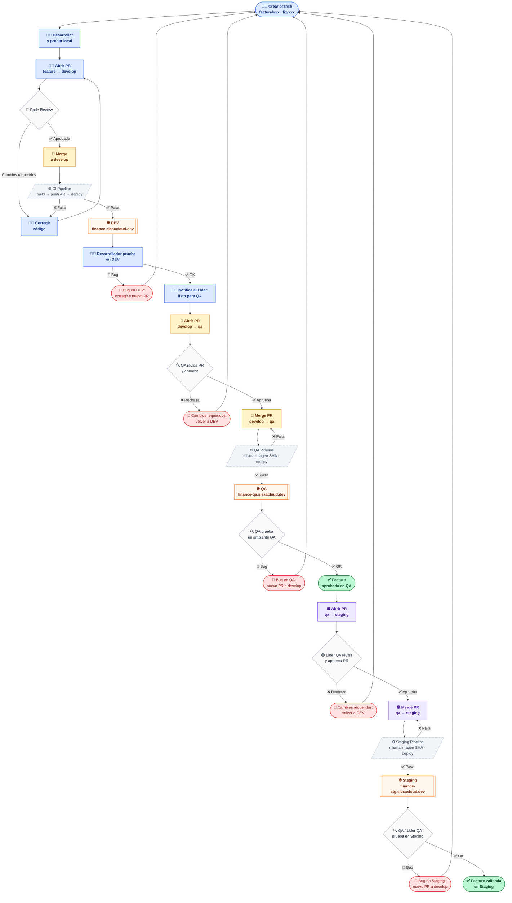

# Flujo de Desarrollo — Roles y Responsabilidades

> Este documento describe **qué hace cada actor, cuándo y por qué** en el ciclo de vida de un cambio:
> desde que un desarrollador empieza a codear hasta que el cambio queda validado en Staging.
>
> **Setup técnico local:** `docs/developer-guide.md`
> **Onboarding de nuevo servicio:** `docs/onboarding.md`
> **Troubleshooting CI/CD:** `docs/troubleshooting.md`

---

## Actores

| Actor | Responsabilidad principal |
|---|---|
| **Desarrollador** | Implementar, probar en DEV, abrir PR a develop |
| **Líder** | Revisar código, aprobar PR, abrir PR develop → qa cuando esté listo |
| **QA** | Revisar y aprobar el PR develop → qa, probar en el ambiente QA |
| **Líder QA** | Decidir cuándo promover a Staging, abrir PR qa → staging |

---

## Flujo completo (visión general)



### Estrategia de ramas

```mermaid
gitGraph LR:
   commit id: "base"

   branch develop
   checkout develop
   commit id: "..."

   branch feature/nueva-func
   checkout feature/nueva-func
   commit id: "impl"
   commit id: "fix review"

   checkout develop
   merge feature/nueva-func id: "PR #42"

   branch feature/otro-fix
   checkout feature/otro-fix
   commit id: "fix"

   checkout develop
   merge feature/otro-fix id: "PR #43"

   branch qa
   checkout qa
   merge develop id: "PR #44 — QA aprueba"

   branch staging
   checkout staging
   merge qa id: "PR #45 — Líder QA promueve"
```

---

## Convención de ramas

| Rama | Ambiente | Cómo se actualiza |
|---|---|---|
| `feature/*` o `fix/*` | Local únicamente | Push libre del desarrollador |
| `develop` | DEV (`finance.siesacloud.dev`) | Solo via PR aprobado por el Líder |
| `qa` | QA (`finance-qa.siesacloud.dev`) | Solo via PR aprobado por QA + Líder |
| `staging` | Staging (`finance-stg.siesacloud.dev`) | Solo via PR aprobado por Líder QA |
| `main` | Producción (futuro) | Solo via PR con aprobación múltiple |

**Regla:** nunca pushear directo a `develop`, `qa` ni `staging` — todas tienen Branch Protection activada.

---

## Configuración Branch Protection en GitHub

Por cada repo de servicio, aplicar en **Settings → Rules → Rulesets**:

### Rama `develop`
- **Require a pull request before merging** ✅
- **Required approvals:** 1 (Líder)
- **Dismiss stale reviews when new commits are pushed** ✅

### Rama `qa`
- **Require a pull request before merging** ✅
- **Required approvals:** 1 (QA team)
- **Allowed merge methods:** solo Merge commit (para preservar la historia)
- **Require status checks to pass:** `Build & Deploy` (el job del CI pipeline en develop)

> Con esta configuración, nadie puede pushear directo a `qa`. El Líder abre el PR,
> GitHub notifica automáticamente al equipo de QA para que lo revise y apruebe.

### Rama `staging`
- **Require a pull request before merging** ✅
- **Required approvals:** 1 (Líder QA)
- **Allowed merge methods:** solo Merge commit (para preservar la historia)
- **Require status checks to pass:** el job del QA pipeline en `qa`

> Solo el Líder QA puede aprobar el PR de `qa → staging`. La Branch Protection impide
> que cualquier otro rol promueva a Staging sin autorización explícita.

---

## Paso 1 — Desarrollador: crear la rama y desarrollar

```bash
git checkout develop
git pull origin develop
git checkout -b feature/nombre-descriptivo
# o
git checkout -b fix/descripcion-del-bug
```

Trabajar localmente usando el setup de `docs/developer-guide.md`:
- Correr el servicio con `dotnet run` o VS Code
- Conectarse a Cloud SQL DEV con `source ./scripts/dev-connect.sh`
- Verificar que Dapr esté activo (`dapr run --app-id ...`)

**Criterios antes de abrir PR:**
- [ ] El código compila sin errores ni warnings relevantes
- [ ] Las migraciones EF Core (si aplica) están incluidas en el commit
- [ ] Los endpoints nuevos tienen su ruta en el deploy repo (`k8s/overlays/dev/routes/`)
- [ ] Los permisos nuevos están registrados en access-manager (ver `/flow-registrar-permisos`)
- [ ] Probado manualmente en local el caso feliz y al menos un caso de error

---

## Paso 2 — Desarrollador: abrir Pull Request a develop

El PR va **siempre de `feature/xxx` hacia `develop`**.

**Checklist del PR:**
- Título: `feat(servicio): descripción` / `fix(servicio): descripción`
- Descripción: qué cambia, por qué, cómo probar
- Si hay migración DB: mencionarla (el Líder valida que no sea destructiva)
- Si hay cambio en la API pública: mencionarlo (puede afectar otros MFEs)
- Si hay cambio en el deploy repo: linkear el PR correspondiente

---

## Paso 3 — Líder: code review

El Líder revisa con foco en:

1. **Corrección funcional** — ¿hace lo que dice? ¿maneja errores?
2. **Seguridad** — ¿valida permisos? ¿usa `RequirePermission`?
3. **Migraciones DB** — ¿son aditivas (no destructivas)?
4. **Impacto en otros servicios** — ¿cambia contratos de API, eventos Pub/Sub, proyecciones?
5. **Dapr** — nuevo consumer: ¿tiene `IEventStore`? ¿`TopicOptions.Match` con Priority único?
6. **Convenciones MFE** — ¿usa `/api/{prefix}/*`? ¿`useXxxDefinition()` como hook?

**Acciones:**
- `Request changes` → desarrollador corrige y pushea al mismo branch
- `Approve` + Merge → el Líder hace el merge (Squash si hay commits WIP, Merge commit si están limpios)

---

## Paso 4 — CI Pipeline: build y deploy automático a DEV

Al hacer merge a `develop`, `ci-pipeline.yml` dispara automáticamente.

1. `docker build` API + MFE
2. `docker push` a Artifact Registry Hub con tag = commit SHA
3. `kustomize build` — genera manifest.yaml con las imágenes del SHA actual
4. Cloud Build: `kubectl apply` del manifest.yaml en GKE DEV
5. Rollout status — timeout 3 min
6. Smoke test: `GET /api/{servicio}/health/live` — retry cada 15s hasta 5 min

**El desarrollador monitorea** que el pipeline pase en GitHub → Actions → `develop`.

Si falla:
- **Error de build**: el desarrollador abre nuevo PR con el fix
- **Error de deploy/smoke test**: coordinar con el Líder para diagnosticar (`docs/troubleshooting.md`)

---

## Paso 5 — Desarrollador: probar en DEV

Una vez que el pipeline pasa, el **desarrollador** valida en `https://finance.siesacloud.dev`.

**Qué probar:**
- El caso de uso principal del ticket/feature
- Casos límite y manejo de errores
- Que no haya regresión visible en flujos relacionados

Si hay bug → abrir `fix/descripcion` desde `develop` y repetir desde el Paso 1.

**Cuando DEV está OK:** el desarrollador notifica al Líder (por el canal acordado del equipo) que el feature está listo y validado en DEV.

---

## Paso 6 — Líder: abrir PR develop → qa

El Líder decide cuándo promover, normalmente agrupando varios features/fixes listos.

```bash
# En el repo del servicio, actualizar qa con los últimos commits de develop
git fetch origin
git checkout -b promote/qa-YYYY-MM-DD origin/develop
git push origin promote/qa-YYYY-MM-DD
# Luego abrir PR de promote/qa-YYYY-MM-DD → qa en GitHub
```

O directamente desde la UI de GitHub: **New pull request** → base: `qa` ← compare: `develop`.

**El PR incluye automáticamente:**
- Lista de todos los commits que van a QA
- Diff completo respecto al último estado de `qa`

**GitHub notifica al equipo de QA** para que revise y apruebe el PR.

> **No usar `git merge develop` directo a `qa`** — la Branch Protection lo bloquea.
> El PR es el mecanismo de control y trazabilidad.

---

## Paso 7 — QA: revisar y aprobar el PR

QA recibe la notificación de GitHub y revisa el PR antes de aprobarlo.

**Qué revisa QA en el PR:**
- Lista de commits: ¿están todos los features acordados para este ciclo?
- ¿Hay algún cambio que deba quedar fuera de este lote?
- ¿Hay migraciones DB que requieran coordinación (grants, scripts manuales)?

**Acciones:**
- `Request changes` → QA pide que se excluya algo o que se corrija antes de promover
- `Approve` → QA da luz verde para que el Líder haga el merge

Una vez aprobado, el **Líder hace el merge** del PR.

---

## Paso 8 — QA Pipeline: deploy automático a QA

Al hacer merge a `qa`, `qa-pipeline.yml` dispara automáticamente.

1. Valida que `qa` incluye todos los commits de `develop` (gate de seguridad)
2. Obtiene el SHA de la última imagen exitosa en DEV — **no recompila**
3. Cloud Build: `kubectl apply` en GKE QA con ese SHA
4. Smoke test: `GET /api/{servicio}/health/live` — retry cada 15s hasta 5 min

**Principio Build Once, Deploy Anywhere:** la imagen en QA es exactamente la misma que pasó por DEV.

**Dónde ver el resultado:** GitHub → Actions → último run en `qa`.

Si hay múltiples servicios a promover: **secuencialmente**, uno a la vez, para evitar la race condition de Master Authorized Networks en el cluster QA.

---

## Paso 9 — QA: pruebas en ambiente QA

QA valida en `https://finance-qa.siesacloud.dev`.

**Diferencias clave respecto a DEV:**
- Autenticación real (sin mock de access-manager)
- Base de datos independiente (`finance-qa`)
- Cloud SQL sin IP pública (PSC endpoint `10.20.39.250`)

**Qué valida QA:**
- Los features aprobados en el PR, ahora con autenticación y datos de QA
- Integración entre servicios (proyecciones, eventos Pub/Sub)
- Performance perceptible (carga de grids, tiempos de respuesta)

**Si encuentra un bug:**
- Reportar al desarrollador con pasos para reproducir, endpoint, screenshot
- El desarrollador abre `fix/descripcion` → PR a `develop` → DEV → Paso 6 de nuevo

---

## Paso 10 — Líder QA: abrir PR qa → staging

Una vez que QA da el visto bueno, el **Líder QA** decide cuándo promover a Staging.

```bash
git fetch origin
git checkout -b promote/staging-YYYY-MM-DD origin/qa
git push origin promote/staging-YYYY-MM-DD
# Luego abrir PR de promote/staging-YYYY-MM-DD → staging en GitHub
```

O directamente desde la UI de GitHub: **New pull request** → base: `staging` ← compare: `qa`.

**El PR incluye automáticamente:**
- Lista de todos los commits que van a Staging
- Diff respecto al último estado de `staging`

> **No usar `git merge qa` directo a `staging`** — la Branch Protection lo bloquea.

**Líder QA revisa:**
- ¿El lote de features está completo y aprobado por QA?
- ¿Hay dependencias de infra pendientes en el deploy repo?

**Acciones:**
- `Approve` + Merge → el Líder QA hace el merge

---

## Paso 11 — Staging Pipeline: deploy automático a Staging

Al hacer merge a `staging`, `staging-pipeline.yml` dispara automáticamente.

1. Valida que `staging` incluye todos los commits de `qa` (gate de seguridad)
2. Obtiene el SHA del último QA Pipeline exitoso — **la misma imagen validada en QA**
3. Cloud Build: `kubectl apply` en GKE Staging con ese SHA
4. Smoke test: `GET /api/{servicio}/health/live` — retry cada 15s hasta 5 min

**Principio Build Once, Deploy Anywhere:** la imagen en Staging es exactamente la misma que pasó por QA.

**Dónde ver el resultado:** GitHub → Actions → último run en `staging`.

---

## Paso 12 — QA / Líder QA: validar en Staging

QA y el Líder QA validan en `https://finance-stg.siesacloud.dev`.

**Diferencias clave respecto a QA:**
- Configuración más cercana a Producción (REGIONAL Cloud SQL, HTTPS real)
- Datos de Staging (independientes de QA)
- Punto de validación final antes de Producción

**Qué valida:**
- Regresión general de los features en un ambiente pre-productivo
- Integraciones externas si las hay (ERPs, identidad)
- Performance bajo carga similar a Producción

**Si encuentra un bug:**
- Reportar al desarrollador → abrir `fix/descripcion` → PR a `develop` → Paso 6

---

## Escenarios especiales

### Bug crítico en DEV (hotfix)

```
Desarrollador → fix/hotfix-xxx → PR a develop (review rápido del Líder)
```
No saltarse el PR aunque sea urgente — el pipeline necesita pasar.

### Cambio en el deploy repo (infra)

Si el feature requiere un nuevo HTTPRoute, componente Dapr, etc.:

1. Desarrollador abre PR en `business-financiero-deploy`
2. Líder revisa y aprueba → merge a `main`
3. `infra-pipeline-dev.yml` aplica los cambios en GKE DEV
4. Luego el PR del servicio a `develop`

**Orden obligatorio: infra primero, servicio después.** Al revés, el smoke test falla.

### Primer deploy de un servicio en QA

Ver `docs/qa-db-grants.md` — hay pasos manuales post-deploy:
- DDL grants por schema (una sola vez)
- El Líder los ejecuta con acceso al cluster QA

### Primer deploy de un servicio en Staging

Igual que QA — ejecutar DDL grants en Cloud SQL Staging para el schema del servicio.
Ver `docs/qa-db-grants.md` como referencia del patrón (adaptar connection string de Staging).

### Discrepancia DEV vs QA

Si algo funciona en DEV pero no en QA:
- Mock activo en DEV pero no en QA → revisar `AccessManager__Mock__Enabled`
- Connection string vieja en el pod → `kubectl exec -n {ns} deploy/{svc}-api -- env | grep ConnectionStrings`
- Schema no creado (primer deploy sin grants) → `docs/qa-db-grants.md`

---

## URLs de los ambientes

| Ambiente | URL base | Cloud SQL | Proyecto GCP |
|---|---|---|---|
| DEV | `https://finance.siesacloud.dev` | `pgsql-fin-sandbox-dev` / `finance-dev` | `prj-sie-fin-financiero-dev` |
| QA | `https://finance-qa.siesacloud.dev` | `pgsql-fin-financiero-qa` / `finance-qa` | `prj-sie-fin-financiero-qas` |
| Staging | `https://finance-stg.siesacloud.dev` | `pgsql-fin-financiero-stg` / `finance-stg` | `prj-sie-fin-financiero-stg` |

**Health check:** `GET /api/{servicio}/health/live` (access-manager: `/api/access-manager/health`)

---

## Resumen de responsabilidades

| Paso | Desarrollador | Líder | QA | Líder QA |
|---|---|---|---|---|
| Crear branch y desarrollar | ✅ | | | |
| Abrir PR feature → develop | ✅ | | | |
| Code review | | ✅ | | |
| Merge a develop | | ✅ | | |
| CI Pipeline DEV | Automático | Monitorea | | |
| Probar en DEV | ✅ | | | |
| Notificar que DEV está OK | ✅ | | | |
| Abrir PR develop → qa | | ✅ | | |
| Revisar y aprobar PR develop → qa | | | ✅ | |
| Merge PR → qa | | ✅ | | |
| QA Pipeline | Automático | Monitorea | | |
| Probar en QA | | | ✅ | |
| Reportar bug QA | | | ✅ | |
| DDL grants (primer deploy QA) | | ✅ | | |
| Abrir PR qa → staging | | | | ✅ |
| Revisar y aprobar PR qa → staging | | | | ✅ |
| Merge PR → staging | | | | ✅ |
| Staging Pipeline | Automático | | | Monitorea |
| Validar en Staging | | | ✅ | ✅ |
| DDL grants (primer deploy Staging) | | | | ✅ |
